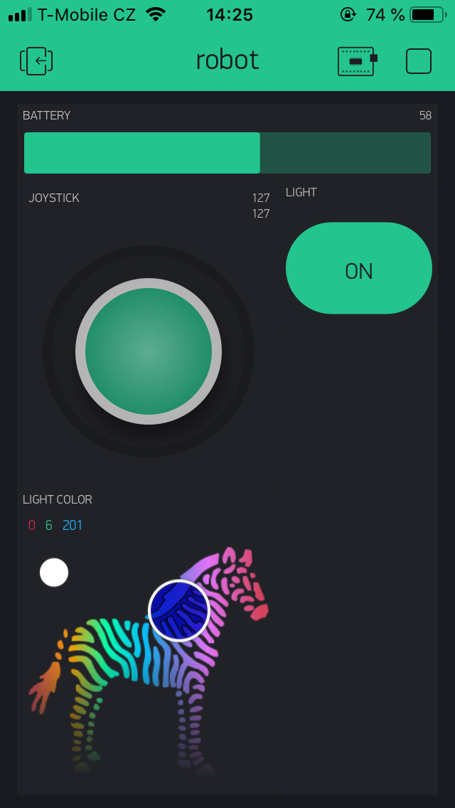
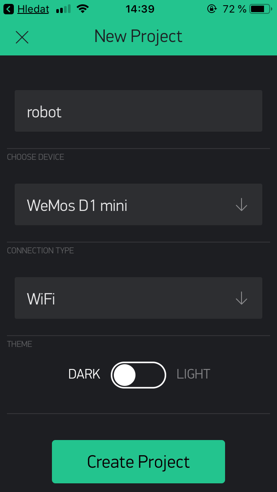
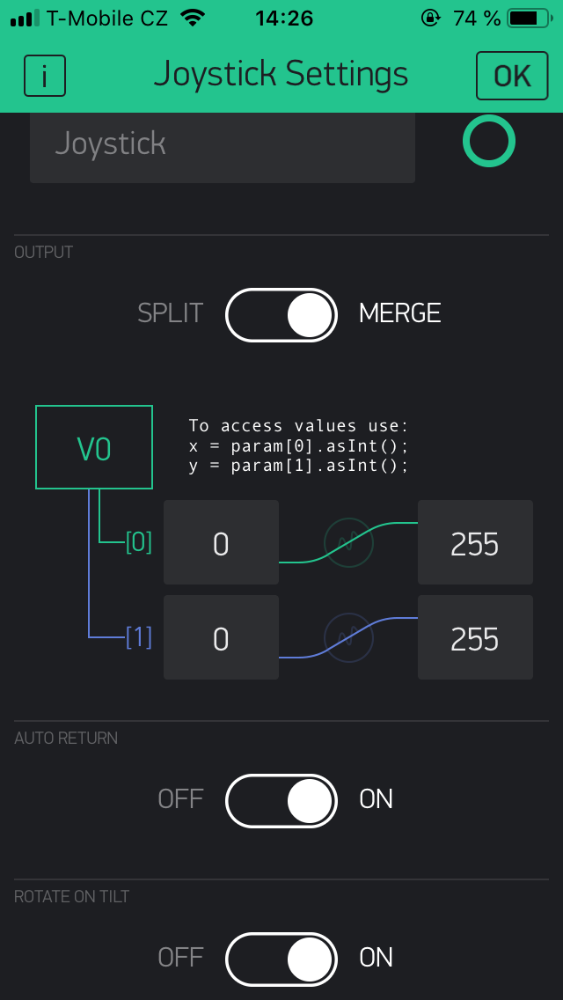
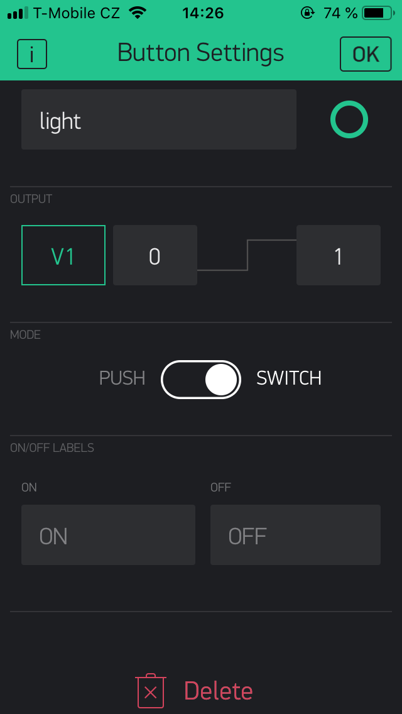
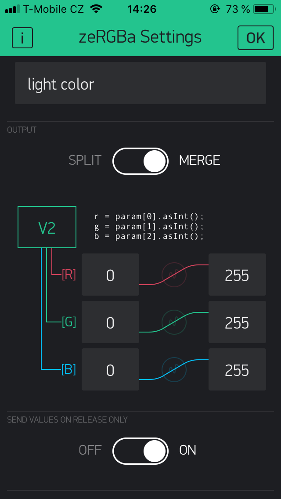
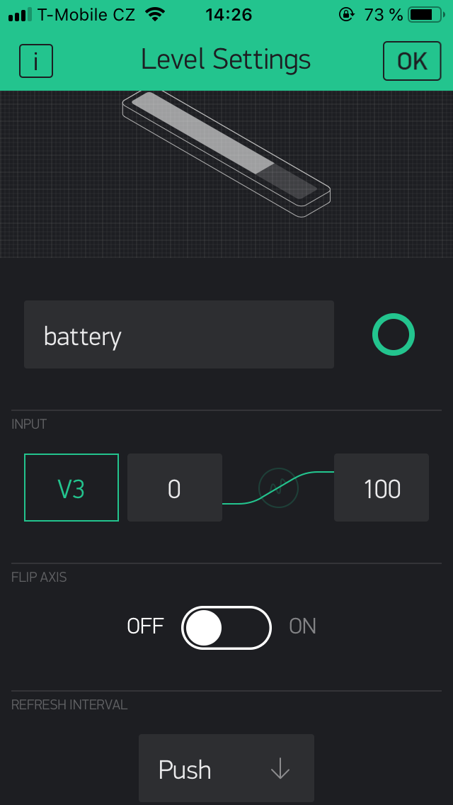

# WiFi robot

ESP8266 chip on Wemos D1 mini module that is driving two DC geared motors using L293D chip. One WS2812 led for status, one tact switch for reset. Possibility of extending functionality via I2C bus.
Firmware contains Blynk platform integration for mobile app control. Can also be controlled using UDP packets.

More resources:
* [3D prints](stl)
* Firmware
  * [Original](firmware/robot) - uses [Arduino core for ESP8266](https://github.com/esp8266/Arduino), using [Blynk](https://blynk.cc) platform
  * [Tester](firmware/robot-test) - testing sketch
* [Hardware assembly](pictures)
* [PCB drawings](board) - created in EAGLE 9.2

## Setup

### On your computer

* Install [Arduino core for ESP8266](https://github.com/esp8266/Arduino#installing-with-boards-manager) - **use version 2.4.2 or above**
* Install the [Blynk Arduino library](http://help.blynk.cc/getting-started-library-auth-token-code-examples/how-to-install-blynk-library-for-arduino)
* Install the [WiFi Manager library](https://github.com/tzapu/WiFiManager)
* Compile and upload the [firmware](firmware/robot)

### On your mobile phone

* Install [Blynk app](https://www.blynk.cc/getting-started/)
* Create account or log in
* Create new empty project in Blynk App
* Copy auth token from the app or your email
* Connect to the robot AP
* Wait for WiFi login popup (or use browser and navigate to `http://192.168.4.1`)
* Enter WiFi credentials and auth token
* Setup the Blynk project (see next section)

### Reconfiguring or resetting robot

* Hold button until status LED lights up with violet color
* Connect to the robot AP
* Wait for WiFi login popup (or use browser and navigate to `http://192.168.4.1`)
* Enter WiFi credentials and auth token

## Blynk project

Total required energy: 1200

### Component settings

